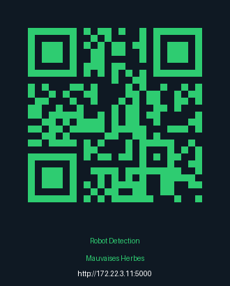
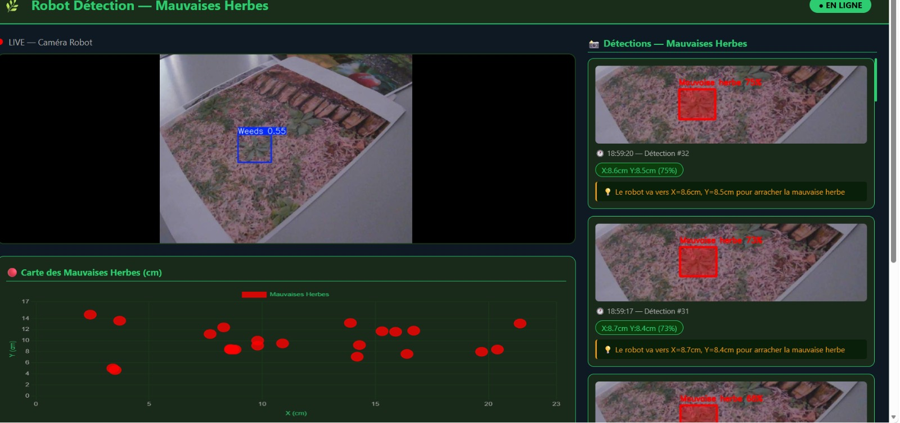
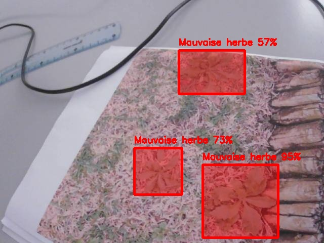

# 🌿 Robot de Détection de Mauvaises Herbes — PLBD_25_

> Détection automatique de mauvaises herbes par robot mobile via vision artificielle YOLOv8 et communication WiFi temps réel.

---

## 📱 QR Code — Accès au Site Web

<p align="center">
  
  <br/>
  <b>Scanner pour accéder au site : http://172.22.3.11:5000</b>
</p>

---

## 📸 Résultats de Détection

| Détection site web | Détections multiples |
|:---:|:---:|
|  |  |

---

## 🏗️ Architecture du Système


```
Raspberry Pi (Robot)          WiFi TCP:9999          PC Windows (Serveur)
--------------------    ----------------------->    --------------------
📷 Camera USB           Envoi frames JPEG           🤖 YOLOv8 50 epochs
🔊 Buzzer GPIO 18       <-----------------------    🌐 Flask port 5000
                        Signal 0 ou 1               💾 Screenshots rouges
                                                    📊 Graphe X,Y en cm
```

---

## 📁 Structure du Projet

| Fichier | Description |
|---------|-------------|
| `robot_client.py` | Code Raspberry Pi — capture + envoi images + buzzer |
| `web_app.py` | Serveur PC — Flask + YOLOv8 + site web |
| `train.py` | Entraînement modèle YOLOv8 |
| `live_pc.py` | Version live sans site web (test initial) |
| `pc_serveur.py` | Test connexion Robot↔PC (première version) |
| `yolov8n.pt` | Poids pré-entraînés YOLOv8 nano |
| `templates/index.html` | Interface web — live stream + détections + graphe |

---

## 🔧 Matériel Utilisé

| Composant | Détails |
|-----------|---------|
| **Robot** | Adeept PiCar Pro V2 |
| **Ordinateur embarqué** | Raspberry Pi |
| **Caméra** | USB 640×480 |
| **Buzzer** | TonalBuzzer GPIO 18 |
| **PC** | Windows — Flask + YOLOv8 |
| **Communication** | WiFi TCP Port 9999 |

---

## 🧠 Modèle YOLOv8

| Paramètre | Valeur |
|-----------|--------|
| **Architecture** | YOLOv8 Nano |
| **Dataset** | Mauvaises herbes Roboflow |
| **Epochs** | 50 |
| **Image size** | 640×640 |
| **Confiance** | 0.5 |
| **Classe** | Weeds |

---

## 🌐 Site Web Flask

| Accès | URL |
|-------|-----|
| **PC** | http://localhost:5000 |
| **Téléphone / Tablette** | http://172.22.3.11:5000 |

Fonctionnalités :

- 📺 Live stream avec boxes YOLOv8
- 📸 Screenshots avec zones rouges
- 📊 Graphe 2D coordonnées X,Y en cm
- 💡 Conseils position mauvaise herbe

---

## 🚀 Installation et Lancement

**Sur le PC :**

```bash
pip install ultralytics flask opencv-python numpy
python web_app.py
```

**Sur le Raspberry Pi :**

```bash
pip install opencv-python gpiozero
sudo python3 robot_client.py
```

**Ouvrir le site :**

```
http://localhost:5000
```

---

## ⚙️ Fonctionnement

- Le robot capture une frame toutes les 0.1 seconde
- La frame est envoyée au PC via WiFi
- YOLOv8 analyse avec un seuil de confiance de 50%
- Si une mauvaise herbe est détectée :
  - Screenshot avec zones rouges sauvegardé
  - Coordonnées X et Y calculées en cm
  - Signal 1 envoyé au robot
  - Buzzer sonne note C4 pendant 1 seconde
- Le site web est mis à jour toutes les 2 secondes

---

## 📐 Conversion Pixels vers Centimètres

La caméra est positionnée à 20 cm du sol.

| Axe | Formule |
|-----|---------|
| **X** | X_cm = (pixel_x / 640) × 23.0 |
| **Y** | Y_cm = (pixel_y / 480) × 17.0 |

---

## 👥 Équipe — Soutenance PLBD_25_

