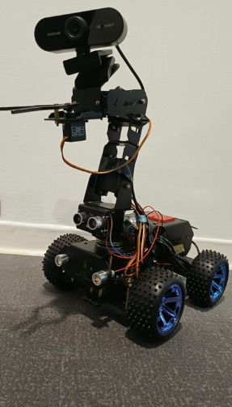

# 🌿 Robot de Détection de Mauvaises Herbes — PLBD_25_

> Projet de fin d'études — Détection automatique de mauvaises herbes par robot mobile via vision artificielle YOLOv8 et communication WiFi temps réel.

---

## 🤖 Notre Robot

<p align="center">
  
  <br/>
  <b>Adeept PiCar Pro V2 — Robot de détection de mauvaises herbes</b>
</p>

---

## 📱 QR Code — Accès au Site Web

<p align="center">
  
  <br/>
  <b>Scanner pour accéder au site : http://172.22.3.11:5000</b>
</p>

---

## 📸 Résultats de Détection

| Détection site web | Détections multiples |
|:---:|:---:|
|  |  |

---

## 🏗️ Architecture du Système

```
Raspberry Pi (Robot)          WiFi TCP:9999          PC Windows (Serveur)
--------------------    ----------------------->    --------------------
📷 Camera USB           Envoi frames JPEG           🤖 YOLOv8 50 epochs
🔊 Buzzer GPIO 18       <-----------------------    🌐 Flask port 5000
                        Signal 0 ou 1               💾 Screenshots rouges
                                                    📊 Graphe X,Y en cm
```

---

## 📁 Structure du Projet

| Fichier | Description |
|---------|-------------|
| `robot_client.py` | Code Raspberry Pi — capture + envoi images + buzzer |
| `web_app.py` | Serveur PC — Flask + YOLOv8 + site web |
| `train.py` | Entraînement modèle YOLOv8 |
| `live_pc.py` | Version live sans site web (test initial) |
| `pc_serveur.py` | Test connexion Robot↔PC (première version) |
| `yolov8n.pt` | Poids pré-entraînés YOLOv8 nano |
| `templates/index.html` | Interface web — live stream + détections + graphe |

---

## 🔧 Matériel Utilisé

| Composant | Détails |
|-----------|---------|
| **Robot** | Adeept PiCar Pro V2 |
| **Ordinateur embarqué** | Raspberry Pi |
| **Caméra** | USB 640×480 |
| **Buzzer** | TonalBuzzer GPIO 18 |
| **PC** | Windows — Flask + YOLOv8 |
| **Communication** | WiFi TCP Port 9999 |

---

## 🧠 Pourquoi YOLOv8 ?

Nous avons choisi **YOLOv8** après comparaison avec YOLOv11 :

| Critère | YOLOv8 ✅ | YOLOv11 ⚠️ |
|---------|-----------|------------|
| **Stabilité** | Très stable et mature | Très récent, moins testé |
| **Documentation** | Complète, beaucoup d'exemples | Documentation limitée |
| **Communauté** | Grande communauté active | Petite communauté |
| **Support CPU** | Très optimisé | Moins optimisé CPU |
| **Compatibilité Pi** | Compatible Raspberry Pi | Problèmes hardware limité |
| **Roboflow** | Support natif complet | Support partiel |

**Conclusion** : Pour un projet embarqué sur Raspberry Pi sans GPU, YOLOv8 est le meilleur choix en termes de stabilité, performance et compatibilité.

---

## 📊 Résultats d'Entraînement

| Paramètre | Valeur |
|-----------|--------|
| **Architecture** | YOLOv8 Nano |
| **Dataset** | Mauvaises herbes Roboflow |
| **Epochs** | 50 |
| **Image size** | 640×640 |
| **Confiance** | 0.5 |
| **Classe** | Weeds |
| **mAP50** | 0.0306 |

---

## 🌐 Site Web Flask

| Accès | URL |
|-------|-----|
| **PC** | http://localhost:5000 |
| **Téléphone / Tablette** | http://172.22.3.11:5000 |

Fonctionnalités :

- 📺 Live stream avec boxes YOLOv8
- 📸 Screenshots avec zones rouges
- 📊 Graphe 2D coordonnées X,Y en cm
- 💡 Conseils position mauvaise herbe

---

## 🚀 Installation et Lancement

**Sur le PC :**

```bash
pip install ultralytics flask opencv-python numpy
python web_app.py
```

**Sur le Raspberry Pi :**

```bash
pip install opencv-python gpiozero
sudo python3 robot_client.py
```

**Ouvrir le site :**

```
http://localhost:5000
```

---

## ⚙️ Fonctionnement

- Le robot capture une frame toutes les 0.1 seconde
- La frame est envoyée au PC via WiFi
- YOLOv8 analyse avec un seuil de confiance de 50%
- Si une mauvaise herbe est détectée :
  - Screenshot avec zones rouges sauvegardé
  - Coordonnées X et Y calculées en cm
  - Signal 1 envoyé au robot
  - Buzzer sonne note C4 pendant 1 seconde
- Le site web est mis à jour toutes les 2 secondes

---

## 📐 Conversion Pixels vers Centimètres

La caméra est positionnée à 20 cm du sol.

| Axe | Formule |
|-----|---------|
| **X** | X_cm = (pixel_x / 640) × 23.0 |
| **Y** | Y_cm = (pixel_y / 480) × 17.0 |

---

## 🔮 Prochaines Étapes — Améliorations Futures

### 1. 🧠 Partie Intelligence Artificielle

- **Tester YOLOv11** — Comparer les performances avec YOLOv8 sur notre dataset une fois la version stabilisée
- **Augmenter le dataset** — Collecter plus d'images pour améliorer la précision
- **Intégrer best.pt dans le Raspberry Pi** — Rendre le robot totalement autonome sans dépendre du PC

```bash
# Transfert du modèle vers Raspberry Pi
scp best.pt kit9@172.22.3.11:/home/kit9/best.pt
```

### 2. 🤖 Partie Robotique

#### a) Nouveaux Composants

| Composant | Utilité |
|-----------|---------|
| **Nouvelle caméra HD** | Meilleure qualité pour détection plus précise |
| **Capteur d'humidité** | Détecter les zones humides pour adapter le traitement |
| **GPS intégré** | Localiser précisément les zones infestées |

#### b) Tests de Mouvement et d'Action

- Résoudre le problème des **moteurs** pour déplacement autonome
- Tester le **mouvement des dents du bras** pour arracher les mauvaises herbes depuis leur **centre de masse** détecté par YOLOv8
- Calibrer la **vitesse de déplacement** pour une couverture optimale du terrain

```
Scénario cible :
Robot détecte mauvaise herbe → calcule centre de masse X,Y
→ se déplace vers X,Y → dents s'ouvrent → arrachage → continue
```

#### c) Intégration du Modèle dans le Raspberry Pi

Objectif : rendre le robot **totalement autonome** sans PC.

| | Situation actuelle | Objectif futur |
|--|-------------------|----------------|
| **Analyse** | Sur PC via WiFi | Sur Raspberry Pi en local |
| **Autonomie** | Besoin du PC | Robot indépendant |
| **Vitesse** | Latence WiFi | Temps réel local |

---

## 👥 Équipe — Soutenance PLBD_25_

---

